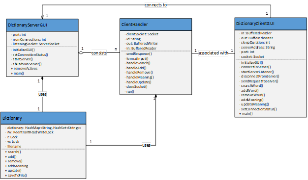
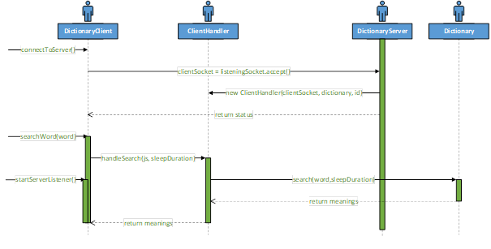

# Dictionary Server Client Application

**Java · Distributed Systems · TCP Sockets · Concurrency**

## Project Overview

A **client–server application** that allows multiple clients to concurrently query and modify a shared dictionary over the network. The server guarantees **thread safety**, **data persistence**, and **reliable communication** while handling simultaneous connections.

This project showcases **low-level network programming**, **concurrency control**, and **distributed system design** without relying on high-level frameworks.

---

## Problems I Solved

- Multiple clients need **simultaneous access** to shared data
- Reads should scale, but **writes must be exclusive**
- Network communication must be **reliable**
- Data must **survive crashes and restarts**
- The system must handle real-world failures gracefully

---

## Features

- Multi-threaded server supporting multiple concurrent client connections
- Thread-safe dictionary access with concurrent reads and exclusive writes using `ReadWriteLock`
- Configurable artificial delay to simulate latency and validate thread safety under concurrent access
- Reliable client–server communication over TCP sockets
- JSON-based request/response messaging using `org.json` and `com.google.gson`
- Persistent dictionary storage with automatic recovery on server restart
- Client GUI for dictionary operations and server GUI for connection monitoring and logging
- Robust handling of network errors, invalid input, and file I/O failures

---

## System Architecture Models





---

## Requirements

### Runtime

- **Java:** JDK 8 or later (tested with Java 11)

### Libraries

- **org.json**
- **com.google.gson**

These libraries are used for message serialization and parsing between client and server.

---

## How to Run

### Start the Server

```bash
java -jar DictionaryServer.jar <port> <dictionary-file>
```

### Start the Client

```bash
java -jar DictionaryClient.jar <server-address> <server-port> <sleep-duration>
```

---

## Tech Stack

- **Language:** Java
- **Networking:** TCP Sockets
- **Concurrency:** Threads, ReadWriteLock
- **Serialization:** org.json, Google Gson
- **GUI:** Java Swing / JavaFX
- **Persistence:** File-based storage
- **Build:** Executable JARs

## Application Preview


